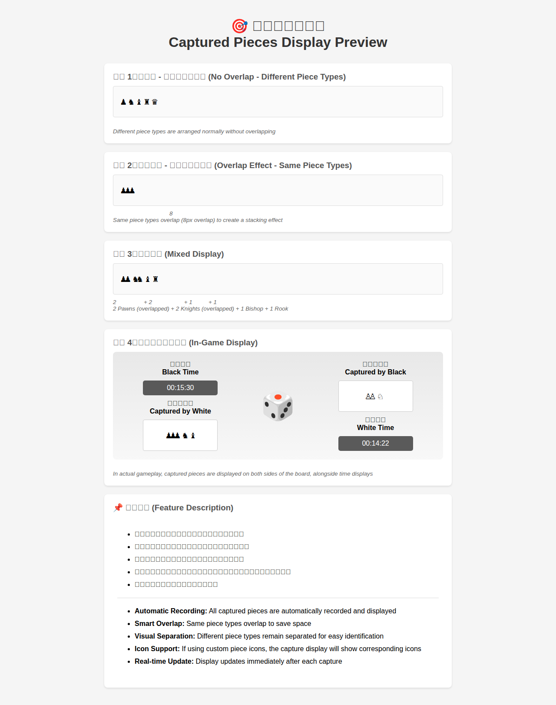

# 吃子紀錄預覽 (Captured Pieces Display Preview)

## 概述 (Overview)

本文件提供了 Qt Chess 應用程式中吃子紀錄顯示功能的視覺預覽和詳細說明。

This document provides a visual preview and detailed description of the captured pieces display feature in the Qt Chess application.

## 預覽圖 (Preview Image)



*完整的吃子紀錄顯示預覽，展示不同情況下的顯示效果*

*Complete captured pieces display preview showing various display scenarios*

## 互動式預覽 (Interactive Preview)

如需查看互動式預覽，請在瀏覽器中打開 [`captured_pieces_preview.html`](captured_pieces_preview.html) 文件。

For an interactive preview, open the [`captured_pieces_preview.html`](captured_pieces_preview.html) file in a browser.

## 功能特性 (Features)

### 1. 自動記錄 (Automatic Recording)
所有被吃掉的棋子會自動記錄並實時顯示在棋盤兩側。

All captured pieces are automatically recorded and displayed in real-time on both sides of the board.

### 2. 智能重疊 (Smart Overlap)
相同類型的棋子會重疊顯示（8像素重疊），創造視覺上的堆疊效果，節省顯示空間。

Same piece types overlap (8px overlap) to create a visual stacking effect, saving display space.

**範例 (Example):**
- 3 個兵 (3 Pawns): ♟♟♟ （重疊顯示 / overlapped）
- 2 個騎士 (2 Knights): ♞♞ （重疊顯示 / overlapped）

### 3. 視覺分離 (Visual Separation)
不同類型的棋子保持正常間距，不會重疊，便於快速識別和統計。

Different piece types maintain normal spacing without overlap, making them easy to identify and count.

**範例 (Example):**
- 1 個兵 + 1 個騎士 (1 Pawn + 1 Knight): ♟ ♞ （分開顯示 / separated）

### 4. 圖標支持 (Icon Support)
如果使用自定義棋子圖標，吃子記錄也會顯示相應的圖標而非 Unicode 符號。

If using custom piece icons, the capture display will show corresponding icons instead of Unicode symbols.

### 5. 實時更新 (Real-time Update)
每次吃子後，顯示會立即更新，無需手動刷新。

Display updates immediately after each capture, no manual refresh needed.

## 顯示位置 (Display Location)

吃子記錄顯示在棋盤的左右兩側：

Captured pieces are displayed on both sides of the board:

- **左側 (Left Side):**
  - 黑方時間顯示 (Black's time display)
  - 白方吃掉的子（黑子）(Pieces captured by White - Black pieces)

- **右側 (Right Side):**
  - 黑方吃掉的子（白子）(Pieces captured by Black - White pieces)
  - 白方時間顯示 (White's time display)

## 顯示範例 (Display Examples)

### 範例 1：無重疊 - 不同類型的棋子
**Example 1: No Overlap - Different Piece Types**

```
♟ ♞ ♝ ♜ ♛
```

不同類型的棋子正常排列，無重疊效果。

Different piece types are arranged normally without overlapping.

### 範例 2：重疊效果 - 相同類型的棋子
**Example 2: Overlap Effect - Same Piece Types**

```
♟♟♟
```

相同類型的棋子會重疊顯示（8像素重疊），創造堆疊效果。

Same piece types overlap (8px overlap) to create a stacking effect.

### 範例 3：混合顯示
**Example 3: Mixed Display**

```
♟♟ ♞♞ ♝ ♜
```

2 個兵（重疊）+ 2 個騎士（重疊）+ 1 個主教 + 1 個城堡

2 Pawns (overlapped) + 2 Knights (overlapped) + 1 Bishop + 1 Rook

## 技術實現 (Technical Implementation)

吃子記錄顯示使用以下技術實現：

The captured pieces display is implemented using:

1. **HTML 富文本渲染 (HTML Rich Text Rendering):**
   - 使用 QLabel 的富文本功能顯示 HTML 內容
   - Uses QLabel's rich text feature to display HTML content

2. **絕對定位 (Absolute Positioning):**
   - 使用 CSS 絕對定位精確控制棋子圖標的位置
   - Uses CSS absolute positioning to precisely control piece icon placement

3. **自動排序 (Automatic Sorting):**
   - 棋子按價值從小到大排序（兵 < 騎士/主教 < 城堡 < 皇后）
   - Pieces are sorted by value from low to high (Pawn < Knight/Bishop < Rook < Queen)

4. **動態重疊計算 (Dynamic Overlap Calculation):**
   - 相同類型：偏移 8 像素
   - 不同類型：偏移 18 像素（棋子寬度）
   - Same type: 8px offset
   - Different type: 18px offset (piece width)

## 相關代碼文件 (Related Code Files)

- `src/qt_chess.h` - 吃子顯示相關變量定義
- `src/qt_chess.cpp` - 吃子顯示實現
  - `updateCapturedPiecesDisplay()` - 更新吃子顯示
  - `renderCapturedPieces()` - 渲染吃子顯示 HTML
  - `getPieceValue()` - 獲取棋子價值
- `src/chessboard.h/cpp` - 吃子記錄邏輯
  - `getCapturedPiecesByColor()` - 獲取被吃掉的棋子列表

## 相關文檔 (Related Documentation)

- [CAPTURED_PIECES_OVERLAP_ANALYSIS.md](CAPTURED_PIECES_OVERLAP_ANALYSIS.md) - 重疊問題技術分析
- [CAPTURED_PIECES_OVERLAP_FIX.md](CAPTURED_PIECES_OVERLAP_FIX.md) - 重疊問題修復方案
- [OVERLAP_VISUAL_GUIDE.md](OVERLAP_VISUAL_GUIDE.md) - 重疊效果視覺指南

## 使用說明 (Usage Instructions)

在遊戲過程中，吃子記錄會自動顯示和更新：

During gameplay, captured pieces are automatically displayed and updated:

1. **開始遊戲 (Start Game):** 開始新遊戲後，吃子記錄區域會顯示為空
   - Start a new game, capture display areas will be empty

2. **進行吃子 (Capture Pieces):** 當任一方吃掉對方棋子時，被吃掉的棋子會立即出現在相應的顯示區域
   - When capturing opponent's pieces, they immediately appear in the corresponding display area

3. **查看記錄 (View Record):** 隨時查看雙方吃掉的棋子數量和類型
   - View the number and types of pieces captured by both sides at any time

4. **重新開始 (Restart):** 開始新遊戲時，吃子記錄會自動清空
   - When starting a new game, the capture record is automatically cleared

## 疑難排解 (Troubleshooting)

### 棋子圖標不顯示 (Piece Icons Not Displaying)

如果您使用了自定義棋子圖標但吃子記錄中沒有顯示：

If you're using custom piece icons but they don't appear in the capture display:

1. 確認圖標文件路徑正確
   - Verify icon file paths are correct

2. 確認圖標格式為 PNG、JPG、SVG 或 BMP
   - Ensure icon format is PNG, JPG, SVG, or BMP

3. 嘗試重新啟動應用程式
   - Try restarting the application

### 棋子重疊不正確 (Incorrect Piece Overlap)

如果棋子重疊顯示不正確：

If piece overlap is displayed incorrectly:

1. 這可能是已知的 Qt 渲染問題，請查閱 [CAPTURED_PIECES_OVERLAP_ANALYSIS.md](CAPTURED_PIECES_OVERLAP_ANALYSIS.md)
   - This may be a known Qt rendering issue, see [CAPTURED_PIECES_OVERLAP_ANALYSIS.md](CAPTURED_PIECES_OVERLAP_ANALYSIS.md)

2. 確認使用的是最新版本的應用程式
   - Ensure you're using the latest version of the application

## 未來改進 (Future Improvements)

可能的未來改進包括：

Possible future improvements include:

- [ ] 顯示物質優勢統計（+3, -2 等）
      - Display material advantage statistics (+3, -2, etc.)

- [ ] 允許用戶自定義顯示樣式（大小、間距等）
      - Allow users to customize display style (size, spacing, etc.)

- [ ] 添加吃子歷史記錄（按時間順序）
      - Add capture history (in chronological order)

- [ ] 支持導出吃子統計數據
      - Support exporting capture statistics

---

## 更新日期 (Last Updated)

2025-11-24
